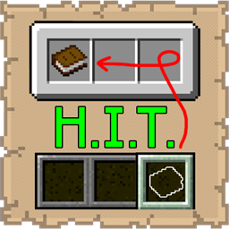

# Hotbar Inventory Transfer

## Functionality

  

  
**Hotbar Inventory Transfer** streamlines your inventory management. Instead of opening your inventory and manually dragging items, you can hover over a hotbar slot and press a hotkey to automatically move that item back into the main inventory area.

* **Smart Transfer**: Prioritizes existing stacks of the same item before occupying new empty slots.
* **Safety Return**: If the main inventory is full, items are safely returned to the hotbar.
* **Configurable Hotkey**: Uses a default keybind of **R**, which can be remapped in the Minecraft settings.

## Benefits

  

  
* **Speed**: Clear your hotbar for building or combat without breaking your flow.
* **Organization**: Keep your active slots clean and ensure items are sent back to the 27-slot main inventory instantly.

## Installation

  

  
1.  **Requirements**: Ensure you have Minecraft 1.21.10, Fabric Loader 0.18.4, and the Fabric API installed.
2.  **Download**: Get the latest `.jar` from [Modrinth](https://modrinth.com/mod/hotbar-inventory-transfer) or [CurseForge](https://www.curseforge.com/minecraft/mc-mods/hotbar-inventory-transfer).
3.  **Setup**: Drop the file into your `%appdata%/.minecraft/mods` folder.
4.  **Configure**: Go to **Options > Controls > Keybinds** to find the "Hotbar Inventory Transfer" category.

## Support

  

  
If you encounter bugs or wish to contribute:
* [Report any problems you find.](https://github.com/armaninyow/Hotbar-Inventory-Transfer/discussions/categories/issues)
* [Share your ideas for new features.](https://github.com/armaninyow/Hotbar-Inventory-Transfer/discussions/categories/suggestions)

## Credits

  

  
* **Author**: Armaninyow
* **License**: Released under [CC0-1.0](https://creativecommons.org/publicdomain/zero/1.0/).

